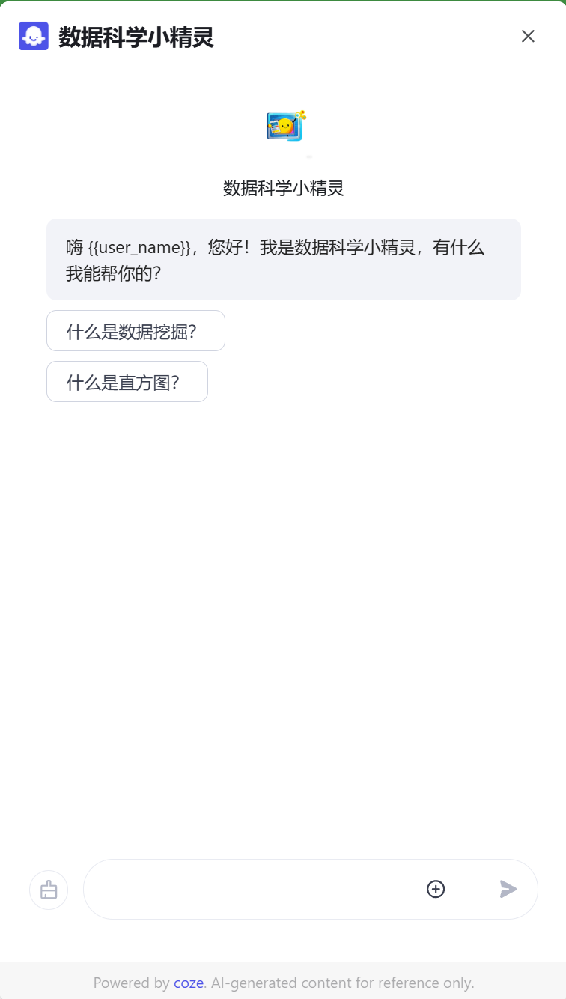

# DataScienceHelper
您的数据科学导论智能助手，耐心解答问题、解释概念和分析案例。通过生动案例和易懂语言，帮助您深入理解数据科学导论，提升学习效率和水平。

# 项目背景

数据科学课程知识点繁杂，亟待 AI 智能体赋能学习，提高学习效率。

# 项目架构

项目采用扣子 Coze 平台搭建，分为智能体与应用两个版本。具体架构如下。

[架构图](架构图.html)


# SDK调用

如果您想在您的网站中插入这个智能体，请复制以下代码插入到网页的`<body>`标签中。

```html
<script src="https://lf-cdn.coze.cn/obj/unpkg/flow-platform/chat-app-sdk/1.1.0-beta.0/libs/cn/index.js"></script>
<script>
    // 初始化 CozeWebSDK 聊天组件
    new CozeWebSDK.WebChatClient({
        config: {
            bot_id: '7452988971405049910',  // 您的聊天机器人 ID
        },
        componentProps: {
            title: '数据科学小精灵',  // 聊天组件的标题
        },
    });
</script>
```

然后您的网页右下角就会出现一个按钮，点击后会展开。

